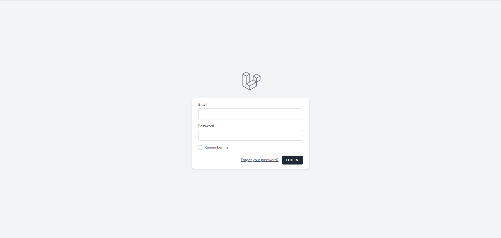
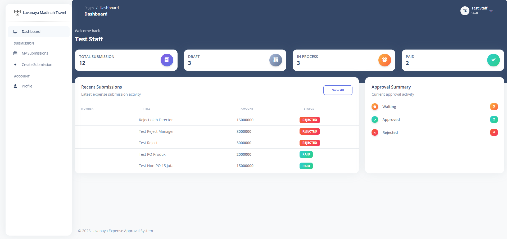
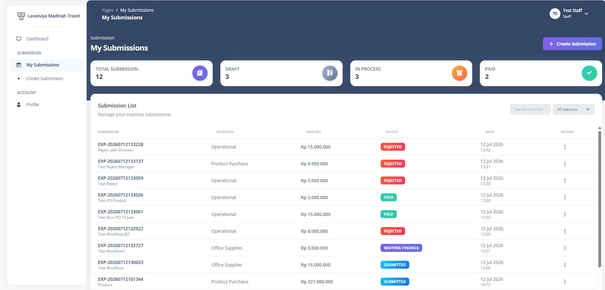
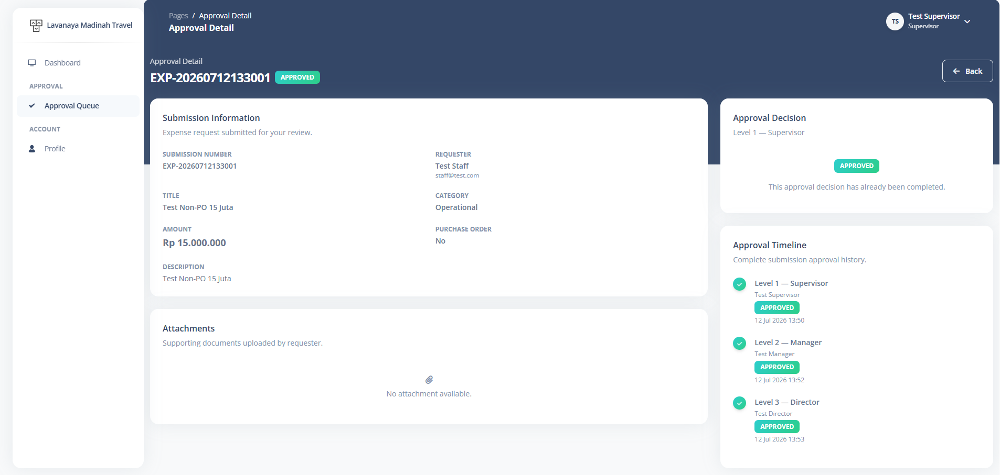
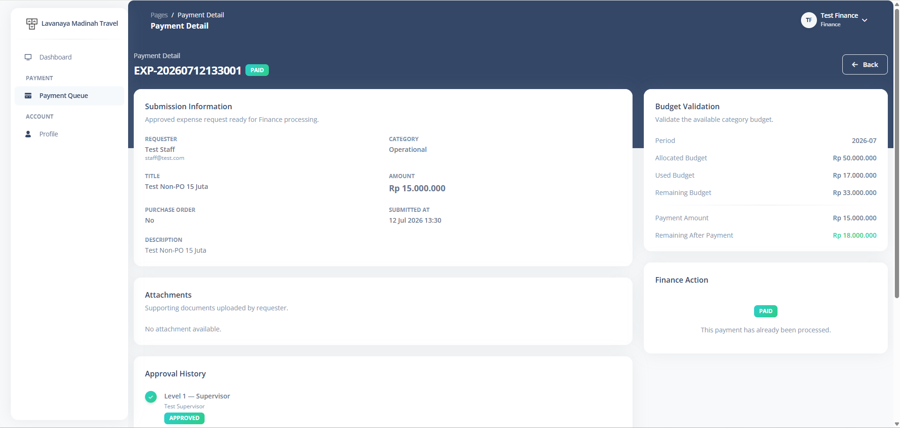

# Lavanaya Expense Approval System

> Technical Test – IT Developer

Sistem Expense Approval berbasis web yang dibangun menggunakan **Laravel 12** untuk mengelola proses pengajuan biaya operasional perusahaan dengan alur approval bertingkat berdasarkan nominal transaksi dan jenis Purchase Order (PO).

---

# 📸 Tampilan Aplikasi

## Login

<p align="center">
    
</p>

---

## Dashboard

<p align="center">
    
</p>

---

## My Submission

<p align="center">
    
</p>

---

## Approval Detail

<p align="center">
    
</p>

---

## Finance Payment

<p align="center">
    
</p>

---

# 📌 Fitur Utama

## Authentication

- Login
- Logout
- Role Based Authentication

---

## Submission

Staff dapat:

- Membuat submission
- Mengubah draft submission
- Menghapus draft submission
- Submit expense
- Upload attachment
- Melihat riwayat submission

---

## Approval Workflow

Workflow approval mengikuti business rule berdasarkan nominal transaksi.

### Purchase Order (PO)

```
Staff
   │
   ▼
Director
   │
   ▼
Finance
```

---

### Non Purchase Order

#### ≤ Rp5.000.000

```
Staff
   │
   ▼
Supervisor
   │
   ▼
Finance
```

---

#### > Rp5.000.000

```
Staff
   │
   ▼
Supervisor
   │
   ▼
Manager
   │
   ▼
Finance
```

---

#### > Rp10.000.000

```
Staff
   │
   ▼
Supervisor
   │
   ▼
Manager
   │
   ▼
Director
   │
   ▼
Finance
```

---

## Finance

Finance dapat:

- Melihat Payment Queue
- Melakukan Budget Validation
- Process Payment
- Reject Payment beserta alasan penolakan

Budget akan otomatis berkurang setelah payment berhasil diproses.

---

## Dashboard

Dashboard berbeda untuk setiap role:

- Staff
- Supervisor
- Manager
- Director
- Finance

Statistik ditampilkan secara realtime berdasarkan data pada database.

---

# ✨ Additional Features

Fitur tambahan yang diimplementasikan di luar requirement utama:

- REST API menggunakan Laravel Sanctum
- Dashboard berdasarkan Role
- Budget Validation sebelum pembayaran
- Upload Attachment
- Timeline Approval
- Toast Notification
- Responsive Layout
- Status Badge
- Service Layer Architecture
- Business Logic Separation
- RESTful API Resource

---

# 🛠 Tech Stack

| Technology      | Version |
| --------------- | ------- |
| PHP             | 8.2+    |
| Laravel         | 12      |
| MySQL           | 8       |
| Laravel Sanctum | Latest  |
| Bootstrap       | 5       |
| Argon Dashboard | 2       |
| Blade           | Latest  |

---

# 🚀 Cara Instalasi

## Clone Repository

```bash
git clone https://github.com/KrakenAura/lavanaya-technical-test
```

Masuk ke folder project

```bash
cd lavanaya-technical-test
```

---

## Install Dependency

```bash
composer install
```

---

## Copy Environment

```bash
cp .env.example .env
```

Windows

```bash
copy .env.example .env
```

---

## Generate Key

```bash
php artisan key:generate
```

---

## Konfigurasi Database

Atur file `.env`

```env
DB_CONNECTION=mysql
DB_HOST=127.0.0.1
DB_PORT=3306
DB_DATABASE=lavanaya
DB_USERNAME=root
DB_PASSWORD=
```

---

## Jalankan Migration & Seeder

```bash
php artisan migrate --seed
```

---

## Storage Link

```bash
php artisan storage:link
```

## Build Asset

### Development

```bash
npm run dev
```

atau

### Production

```bash
npm run build
```

---

## Menjalankan Aplikasi

```bash
php artisan serve
```

Aplikasi dapat diakses melalui

```
http://127.0.0.1:8000
```

---

# 🗄 Struktur Database

Tabel utama:

```
users
roles
expense_categories
budgets
submissions
attachments
approvals
payments
```

---

# 👤 Akun Login Testing

## Staff

Email

```
staff@test.com
```

Password

```
P@ssw0rd123!
```

---

## Supervisor

Email

```
spv@test.com
```

Password

```
P@ssw0rd123!
```

---

## Manager

Email

```
manager@test.com
```

Password

```
P@ssw0rd123!
```

---

## Director

Email

```
director@test.com
```

Password

```
P@ssw0rd123!
```

---

## Finance

Email

```
finance@test.com
```

Password

```
P@ssw0rd123!
```

---

# 🔄 Workflow Sistem

```text
Draft Submission
        │
        ▼
Submit
        │
        ▼
Approval Workflow
        │
        ▼
Waiting Finance
        │
        ▼
Budget Validation
        │
        ▼
Process Payment
        │
        ▼
Paid
```

Submission dapat ditolak pada setiap tahapan Approval maupun pada proses Finance.

---

# 🔌 REST API

REST API diimplementasikan sebagai **additional feature** menggunakan Laravel Sanctum.

## Authentication

```
POST /api/v1/login
POST /api/v1/logout
```

---

## Submission

```
GET     /api/v1/submissions
POST    /api/v1/submissions
GET     /api/v1/submissions/{submission}
PUT     /api/v1/submissions/{submission}
DELETE  /api/v1/submissions/{submission}
POST    /api/v1/submissions/{submission}/submit
```

---

## Approval

```
POST /api/v1/approvals/{approval}/approve
POST /api/v1/approvals/{approval}/reject
```

---

## Attachment

```
POST   /api/v1/submissions/{submission}/attachments
DELETE /api/v1/attachments/{attachment}
```

---

## Dashboard

```
GET /api/v1/dashboard
```

> Modul Finance saat ini diimplementasikan melalui Web Interface.

---

# 📂 Struktur Project

```
app
├── Http
│   ├── Controllers
│   │   ├── Api
│   │   └── Web
│   ├── Middleware
│   └── Requests
│
├── Models
├── Policies
├── Services

database
├── factories
├── migrations
└── seeders

resources
├── views
├── components

routes
├── web.php
└── api.php
```

---

# 📋 Requirement yang Diimplementasikan

✅ Authentication

✅ Expense Submission

✅ Multi Level Approval

✅ Finance Payment

✅ Budget Validation

✅ Role Based Authorization

✅ Dashboard

✅ Attachment Upload

✅ REST API

---

# 👨‍💻 Author

**Abdul Karim**

Technical Test – IT Developer
